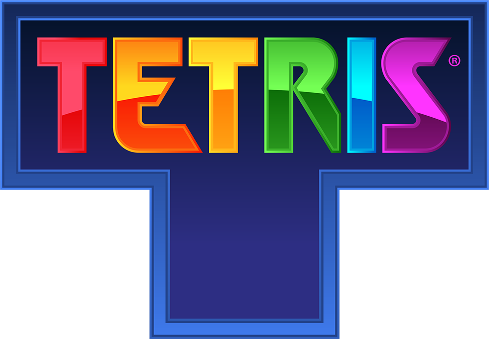

# Classic Tetris

[](https://opensource.org/licenses/MIT) [](https://github.com/NickScherbakov/very-simple-tetris-created-by-Copilot) [](https://github.com/NickScherbakov/very-simple-tetris-created-by-Copilot/fork) [](https://nickscherbakov.github.io/very-simple-tetris-created-by-Copilot/) [](https://nickscherbakov.github.io/very-simple-tetris-created-by-Copilot/)  [](https://github.com/features/copilot)

Классическая игра Tetris, реализованная с использованием HTML, CSS и JavaScript.



Наша версия (https://nickscherbakov.github.io/very-simple-tetris-created-by-Copilot/)

## 📱 Играть на мобильном

### 📲 Для телефонов с экраном до 5 дюймов

Отсканируйте QR-код, чтобы открыть версию игры, оптимизированную для маленьких экранов (≤ 5 дюймов):


> ⚠️ Этот QR-код предназначен для смартфонов с экраном **до 5 дюймов** по диагонали. На устройстве с большим экраном появится сообщение о совместимости и ссылка на полную версию.

### 🖥️ Полная версия (все устройства)

[](https://nickscherbakov.github.io/very-simple-tetris-created-by-Copilot/)

> 💡 **Совет:** Добавьте игру на главный экран для получения нативного приложения! Игра работает оффлайн как PWA.

## Описание 

Эта реализация классической игры Tetris включает все основные элементы оригинала и добавляет современные улучшения:
- Семь стандартных тетромино (I, J, L, O, S, T, Z)
- Повышение сложности на каждом новом уровне
- Система подсчета очков с бонусами за мягкое/жесткое падение
- Отображение следующей фигуры
- Возможность включения/отключения сетки
- Адаптивный обучающий движок, анализирующий ошибки игрока
- Дополнительные сенсорные кнопки для мобильных устройств
- Сохранение рекорда и настройки сетки между сессиями

## ✨ Особенности

### 🎮 Основной геймплей
- Классический Тетрис с 7 стандартными тетромино (I, J, L, O, S, T, Z)
- Плавная отрисовка на canvas с частотой 60 FPS
- Призрачная фигура, показывающая, где приземлится активная фигура
- Система подсчета очков с бонусами за мягкое/жесткое падение
- Прогрессия уровней с увеличением скорости (каждые 10 линий)
- Предпросмотр следующей фигуры
- Функция паузы/возобновления
- Переключаемая сетка

### 🔊 Звуковая система
- Процедурные 8-битные звуковые эффекты через Web Audio API
- Уникальные звуки для движения, поворота, падения, очистки линий, Тетриса, повышения уровня, окончания игры
- Управление громкостью и переключатель отключения звука
- Без внешних аудиофайлов — все звуки генерируются программно

### 🤖 AI функции
- Адаптивный обучающий движок, анализирующий ошибки игрока
- Панель AI Insight с обратной связью о стратегии в реальном времени
- **Режим AI против AI** — наблюдайте за соревнованием двух AI игроков
- Двойная система AI: агрессивный (AI 1) против защитного (AI 2)
- Вмешательство игрока — возьмите управление от AI в любое время

### 🎨 Система тем и магазин
- 8 приобретаемых визуальных тем (Classic, Ocean, Inferno, Matrix, Neon, Pastel, Gold, Rainbow)
- Магазин TetriCoins для траты виртуальной валюты
- Множественные стили отрисовки блоков (плоский, градиент, глянцевый)
- Сохранение предпочтений темы

### 💰 Виртуальная экономика
- Виртуальная валюта TetriCoins (TC)
- Зарабатывайте TC, очищая линии (10-500 TC в зависимости от очищенных линий)
- Ежедневный бонус (+100 TC)
- Система ставок для матчей AI против AI (4 типа ставок с разными коэффициентами)
- Турнирный режим с системой джекпота

### 📹 Система повторов
- Запись игровых сессий в виде компактных логов ввода
- Обмен повторами через URL-ссылки — получатели могут смотреть вашу игру
- Сохранение до 10 повторов локально
- Детерминированное воспроизведение с использованием генерации случайных чисел с сидом
- Интеграция с Web Share API для обмена на мобильных устройствах

### 🏆 Достижения и социальные функции
- Система достижений с наградами TC
- Локальная таблица лидеров (Топ 10)
- Социальный обмен (счет, повторы)
- Уведомления о достижениях с анимациями

### 📱 Прогрессивное веб-приложение
- Устанавливается на мобильные устройства (Добавить на главный экран)
- Полная поддержка оффлайн через Service Worker
- Адаптивный дизайн для мобильных устройств, планшетов и компьютеров
- Сенсорное управление с жестами свайпа
- Тактильная обратная связь (Vibration API)

### 🌍 Интернационализация
- 4 языка: English, Русский, 中文, العربية
- Экран выбора языка при первом посещении
- Полный перевод UI, включая достижения, магазин и повторы

## 🎮 Управление

### Клавиатура
| Клавиша | Действие |
|---------|----------|
| ← → | Перемещение фигуры влево/вправо |
| ↑ | Поворот фигуры |
| ↓ | Мягкое падение (быстрое снижение) |
| Пробел | Жесткое падение (мгновенное размещение) |
| P | Пауза / Возобновление |
| G | Переключение сетки |
| M | Отключение / Включение звука |
| T | Взять управление (режим AI против AI) |

### Сенсорное управление (мобильные)
- **Свайп влево/вправо** — Перемещение фигуры
- **Касание** — Поворот
- **Свайп вниз** — Жесткое падение
- Экранные кнопки для всех элементов управления

### Режим AI против AI
- **Кнопка режима AI против AI** — Начать соревнование AI
- **Клавиша T / Кнопка взять управление** — Вмешаться в игру AI
- **Кнопка выхода из режима AI** — Вернуться к обычной игре

## Система подсчета очков

- 1 линия: 40 × уровень
- 2 линии: 100 × уровень
- 3 линии: 300 × уровень
- 4 линии: 1200 × уровень
- Мягкое падение: +1 очко за каждую ячейку
- Жесткое падение: +2 очка за каждую ячейку

## 🛠️ Технологический стек

| Технология | Использование |
|-----------|---------------|
| HTML5 Canvas | Отрисовка игры |
| CSS3 | Адаптивный UI, анимации, темы |
| Vanilla JavaScript | Игровая логика, ES модули |
| Web Audio API | Процедурная генерация звука |
| Service Worker | Поддержка оффлайн PWA |
| LocalStorage | Постоянные данные (счет, темы, повторы) |
| Web Share API | Нативный обмен на мобильных |
| Vibration API | Тактильная обратная связь |

**Без внешних зависимостей** — всё построено на нативных веб-API.

## Адаптивный обучающий ИИ

Встроенный тренер отслеживает каждое ваше действие: если определенные фигуры приводят к появлению «дыр» или высоким башням, такие тетромино будут выпадать чаще, а полезные фигуры — реже. Скорость падения при этом никогда не меняется, чтобы сохранить честный геймплей. Во время партии панель **AI Insight** подсказывает, на что сейчас делает упор ИИ, а после проигрыша подробно объясняет, как именно ему удалось использовать ваши ошибки — так вы сможете скорректировать стратегию в следующий раз.

## Установка и запуск

1. Клонируйте репозиторий или скачайте файлы проекта
2. Откройте `index.html` в любом современном веб-браузере
3. Нажмите кнопку "Start Game" для начала игры

## 📁 Структура проекта

```
├── index.html                  # Основной HTML файл
├── tetris.js                   # Главная точка входа игры (ES модуль)
├── style.css                   # Основные стили
├── sw.js                       # Service Worker
├── manifest.json               # PWA манифест
├── css/
│   ├── betting-panel.css       # Стили UI ставок
│   ├── language.css            # Стили выбора языка
│   ├── share.css               # Стили UI обмена
│   └── team-tournament.css     # Стили турниров
├── js/
│   ├── achievements.js         # Система достижений
│   ├── betting.js              # Система ставок
│   ├── currency.js             # Валюта TetriCoins
│   ├── i18n.js                 # Интернационализация
│   ├── language-selector.js    # UI выбора языка
│   ├── pwa.js                  # Регистрация PWA
│   ├── team-tournament.js      # Логика турниров
│   ├── team-tournament-ui.js   # UI турниров
│   └── modules/
│       ├── core/               # Основная игровая логика
│       ├── rendering/          # Отрисовка на Canvas
│       ├── input/              # Обработка ввода
│       ├── ai/                 # AI системы
│       ├── audio/              # Звуковой движок
│       └── game/               # Игровые системы (подсчет очков, UI, темы, повторы)
├── icons/                      # PWA иконки
├── tetris-textbook*.md         # Учебники по игре
├── tetris-strategist*.md       # Руководства по стратегии
└── README*.md                  # Документация (EN, RU, CH)
```

## Технологии

Этот проект использует нативные веб-технологии без внешних зависимостей.

## 🤝 Внесение вклада

Мы приветствуем вклад! См. [CONTRIBUTING.md](CONTRIBUTING.md) для руководства.

### Быстрый старт для участников
1. Форкните репозиторий
2. Откройте `index.html` в браузере (сборка не требуется!)
3. Внесите изменения
4. Отправьте Pull Request

### Хорошие первые задачи
- 🌐 Добавить переводы для новых языков (японский, корейский, испанский и т.д.)
- 🎨 Создать новые визуальные темы
- 🔊 Добавить новые звуковые паттерны
- 📝 Улучшить документацию
- 🐛 Сообщить и исправить баги

См. [ROADMAP.md](ROADMAP.md) для большего количества идей.

## AI Prompt for Recreation

### Prompt for AI Assistant

Create a classic Tetris game implementation using HTML, CSS, and JavaScript with the following specifications:

1. **Game Structure**:
   - Create an HTML file with a main game canvas (300x600px) for the Tetris board
   - Add a secondary canvas (100x100px) to display the next piece
   - Set up a score display area showing score, level, and lines cleared
   - Include Start/Restart button and Grid Toggle button
   - Add a controls guide section

2. **Game Mechanics**:
   - Implement a 10x20 grid for the game board
   - Create the 7 standard tetromino shapes (I, J, L, O, S, T, Z) with distinct colors
   - Set up piece movement (left, right, down), rotation, and collision detection
   - Implement soft drop (faster descent) and hard drop (instant placement)
   - Add line clearing with appropriate scoring
   - Implement level progression (every 10 lines) with increasing speed
   - Include game over detection when pieces stack to the top
   - Add pause functionality

3. **Visual Elements**:
   - Style the game with a dark theme (black background for game area)
   - Add a shine effect to each tetromino block
   - Implement optional grid display that can be toggled on/off
   - Create a start screen, pause screen, and game over screen with appropriate messages
   - Ensure the next piece preview shows the upcoming tetromino centered in its canvas

4. **Controls**:
   - Arrow keys for movement (left, right, down) and rotation (up)
   - Space bar for hard drop
   - P key for pause/resume
   - G key for toggling grid visibility

5. **Scoring System**:
   - 40 × level points for 1 line
   - 100 × level points for 2 lines
   - 300 × level points for 3 lines
   - 1200 × level points for 4 lines
   - 1 bonus point for each cell in soft drop
   - 2 bonus points for each cell in hard drop

Implement the game using vanilla JavaScript with the Canvas API for rendering, ensuring smooth gameplay with appropriate animation timing. The implementation should be responsive and work in modern browsers without external libraries.

## Автор

[Ваше имя] - [ссылка на профиль или контакты]

## Лицензия

Этот проект лицензирован под [укажите лицензию, например, MIT License] - см. файл LICENSE для подробностей.
