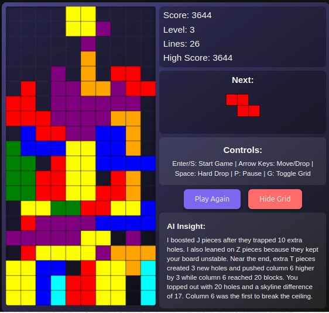

# Classic Tetris

[](https://opensource.org/licenses/MIT) [](https://github.com/NickScherbakov/very-simple-tetris-created-by-Copilot) [](https://github.com/NickScherbakov/very-simple-tetris-created-by-Copilot/fork) [](https://nickscherbakov.github.io/very-simple-tetris-created-by-Copilot/) [](https://nickscherbakov.github.io/very-simple-tetris-created-by-Copilot/) []() [](https://github.com/features/copilot)

A classic Tetris game implemented using HTML, CSS, JavaScript ... and little AI-trainer-mentor

## Screenshot



## 📱 Play on Mobile

Scan the QR code to play instantly on your phone:


> 💡 **Tip:** Add the game to your home screen for a native app experience! The game works offline as a PWA.

## Description

This implementation of the classic Tetris game includes all the main elements of the original—plus several modern enhancements:
- Seven standard tetrominos (I, J, L, O, S, T, Z)
- Increasing difficulty with each level
- Scoring system with soft/hard drop bonuses
- Display of the next piece
- **Ghost piece preview** - See where your piece will land with a semi-transparent shadow
- Option to enable/disable the grid overlay
- **Procedural 8-bit sound system** using Web Audio API - Game sounds with no external dependencies
- Adaptive learning engine that analyzes player mistakes
- Optional touch controls for mobile and tablet devices
- Persistent high-score and grid preference storage

## ✨ Features

### 🎮 Core Gameplay
- Classic Tetris with 7 standard tetrominos (I, J, L, O, S, T, Z)
- Smooth canvas-based rendering at 60 FPS
- Ghost piece showing where the active piece will land
- Scoring system with soft/hard drop bonuses
- Level progression with increasing speed (every 10 lines)
- Next piece preview
- Pause/resume functionality
- Toggleable grid overlay

### 🔊 Sound System
- Procedural 8-bit sound effects via Web Audio API
- Unique sounds for move, rotate, drop, line clear, Tetris, level up, game over
- Volume control and mute toggle
- Zero external audio files — all sounds generated programmatically

### 🤖 AI Features
- Adaptive learning engine that analyzes player mistakes
- AI Insight panel with real-time strategy feedback
- **AI vs AI Mode** — watch two AI players compete
- Dual AI system: aggressive (AI 1) vs defensive (AI 2)
- Player intervention — take control from AI at any time

### 🎨 Theme System & Shop
- 8 purchasable visual themes (Classic, Ocean, Inferno, Matrix, Neon, Pastel, Gold, Rainbow)
- TetriCoins shop for spending virtual currency
- Multiple block rendering styles (flat, gradient, glossy)
- Persistent theme preferences

### 💰 Virtual Economy
- TetriCoins (TC) virtual currency
- Earn TC by clearing lines (10-500 TC based on lines cleared)
- Daily bonus (+100 TC)
- Betting system for AI vs AI matches (4 bet types with different odds)
- Tournament mode with jackpot system

### 📹 Replay System
- Record game sessions as compact input logs
- Share replays via URL links — recipients can watch your game
- Save up to 10 replays locally
- Deterministic playback using seeded random generation
- Web Share API integration for mobile sharing

### 🏆 Achievements & Social
- Achievement system with TC rewards
- Local leaderboard (Top 10)
- Social sharing (score, replays)
- Achievement notifications with animations

### 📱 Progressive Web App
- Installable on mobile devices (Add to Home Screen)
- Full offline support via Service Worker
- Responsive design for mobile, tablet, and desktop
- Touch controls with swipe gestures
- Haptic feedback (vibration API)

### 🌍 Internationalization
- 4 languages: English, Русский, 中文, العربية
- Language selection screen on first visit
- Full UI translation including achievements, shop, and replays

## 🎮 Controls

### Keyboard
| Key | Action |
|-----|--------|
| ← → | Move piece left/right |
| ↑ | Rotate piece |
| ↓ | Soft drop (faster descent) |
| Space | Hard drop (instant placement) |
| P | Pause / Resume |
| G | Toggle grid overlay |
| M | Mute / Unmute sound |
| T | Take control (AI vs AI mode) |

### Touch (Mobile)
- **Swipe left/right** — Move piece
- **Tap** — Rotate
- **Swipe down** — Hard drop
- On-screen buttons for all controls

### AI vs AI Mode
- **AI vs AI Mode button** — Start AI competition
- **T key / Take Control button** — Intervene in AI gameplay
- **Exit AI Mode button** — Return to normal play

## Scoring System

- 1 line: 40 × level
- 2 lines: 100 × level
- 3 lines: 300 × level
- 4 lines: 1200 × level
- Soft drop: +1 point per cell
- Hard drop: +2 points per cell

## 🛠️ Technology Stack

| Technology | Usage |
|-----------|-------|
| HTML5 Canvas | Game rendering |
| CSS3 | Responsive UI, animations, themes |
| Vanilla JavaScript | Game logic, ES modules |
| Web Audio API | Procedural sound generation |
| Service Worker | Offline PWA support |
| LocalStorage | Persistent data (scores, themes, replays) |
| Web Share API | Native sharing on mobile |
| Vibration API | Haptic feedback |

**Zero external dependencies** — everything is built with native web APIs.

## Installation and Launch

1. Clone the repository or download the project files
2. Open `index.html` in any modern web browser
3. Click the "Start Game" button to begin playing

## 📁 Project Structure

```
├── index.html                  # Main HTML file
├── tetris.js                   # Main game entry point (ES module)
├── style.css                   # Core styles
├── sw.js                       # Service Worker
├── manifest.json               # PWA manifest
├── css/
│   ├── betting-panel.css       # Betting UI styles
│   ├── language.css            # Language selection styles
│   ├── share.css               # Share UI styles
│   └── team-tournament.css     # Tournament styles
├── js/
│   ├── achievements.js         # Achievement system
│   ├── betting.js              # Betting system
│   ├── currency.js             # TetriCoins currency
│   ├── i18n.js                 # Internationalization
│   ├── language-selector.js    # Language UI
│   ├── pwa.js                  # PWA registration
│   ├── team-tournament.js      # Tournament logic
│   ├── team-tournament-ui.js   # Tournament UI
│   └── modules/
│       ├── core/               # Core game logic
│       ├── rendering/          # Canvas rendering
│       ├── input/              # Input handling
│       ├── ai/                 # AI systems
│       ├── audio/              # Sound engine
│       └── game/               # Game systems (scoring, UI, themes, replays)
├── icons/                      # PWA icons
├── tetris-textbook*.md         # Game tutorials
├── tetris-strategist*.md       # Strategy guides
└── README*.md                  # Documentation (EN, RU, CH)
```

## AI vs AI Game Mode

**New Feature!** Watch two AI players compete against each other in this exciting game mode that demonstrates advanced strategic thinking and adaptive learning.

### How It Works

1. **AI Competition**: Two independent AI engines play against each other, each learning and adapting to the board state
2. **Real-time Analysis**: Each AI shows its thinking process and strategic planning in real-time
3. **Player Learning**: Observe sophisticated AI decision-making to improve your own Tetris skills
4. **Player Intervention**: Take control at any time using the 'T' key or "Take Control" button

### AI vs AI Features

- **Dual AI System**: Two separate AI players with independent learning algorithms
- **Strategic Analysis**: Each AI analyzes the board and explains its reasoning
- **Visual Feedback**: Color-coded UI showing which AI is active (Red AI 1 vs Blue AI 2)
- **Educational Value**: Perfect for learning advanced Tetris strategies by observing AI gameplay
- **Seamless Integration**: Switch between normal gameplay and AI vs AI mode instantly

### Controls (AI vs AI Mode)

- **AI vs AI Mode Button**: Start AI vs AI gameplay
- **T Key**: Take control from the current AI player
- **Take Control Button**: Alternative way to intervene in AI gameplay
- **Exit AI Mode Button**: Return to normal gameplay

This mode is perfect for players who want to:
- Learn advanced Tetris strategies by watching AI gameplay
- Understand how different AI approaches handle various board situations
- Practice taking over from AI at critical moments
- Experience the educational value of AI vs AI competition

## Adaptive Learning AI

The built-in trainer observes each of your placements and increases the frequency of pieces that caused trouble—such as creating holes or raising tall columns—while reducing shapes that helped you recover. It never changes the fall speed, keeping gameplay fair. During the round the **AI Insight** panel calls out what it noticed most recently, and after a top-out it explains exactly how it capitalized on your mistakes so you can adjust your strategy next time.

## AI Prompt for Recreation

### Prompt for AI Assistant

Create a classic Tetris game implementation using HTML, CSS, and JavaScript with the following specifications:

1. **Game Structure**:
   - Create an HTML file with a main game canvas (300x600px) for the Tetris board
   - Add a secondary canvas (100x100px) to display the next piece
   - Set up a score display area showing score, level, and lines cleared
   - Include Start/Restart button and Grid Toggle button
   - Add a controls guide section

2. **Game Mechanics**:
   - Implement a 10x20 grid for the game board
   - Create the 7 standard tetromino shapes (I, J, L, O, S, T, Z) with distinct colors
   - Set up piece movement (left, right, down), rotation, and collision detection
   - Implement soft drop (faster descent) and hard drop (instant placement)
   - Add line clearing with appropriate scoring
   - Implement level progression (every 10 lines) with increasing speed
   - Include game over detection when pieces stack to the top
   - Add pause functionality

3. **Visual Elements**:
   - Style the game with a dark theme (black background for game area)
   - Add a shine effect to each tetromino block
   - Implement optional grid display that can be toggled on/off
   - Create a start screen, pause screen, and game over screen with appropriate messages
   - Ensure the next piece preview shows the upcoming tetromino centered in its canvas

4. **Controls**:
   - Arrow keys for movement (left, right, down) and rotation (up)
   - Space bar for hard drop
   - P key for pause/resume
   - G key for toggling grid visibility

5. **Scoring System**:
   - 40 × level points for 1 line
   - 100 × level points for 2 lines
   - 300 × level points for 3 lines
   - 1200 × level points for 4 lines
   - 1 bonus point for each cell in soft drop
   - 2 bonus points for each cell in hard drop

Implement the game using vanilla JavaScript with the Canvas API for rendering, ensuring smooth gameplay with appropriate animation timing. The implementation should be responsive and work in modern browsers without external libraries.

## 🤝 Contributing

We welcome contributions! See [CONTRIBUTING.md](CONTRIBUTING.md) for guidelines.

### Quick Start for Contributors
1. Fork the repository
2. Open `index.html` in a browser (no build step needed!)
3. Make your changes
4. Submit a Pull Request

### Good First Issues
- 🌐 Add translations for new languages (Japanese, Korean, Spanish, etc.)
- 🎨 Create new visual themes
- 🔊 Add new sound patterns
- 📝 Improve documentation
- 🐛 Report and fix bugs

See the [ROADMAP.md](ROADMAP.md) for more ideas.

## Author

[GitHub Copilot] + [NinelGPT]

  - https://www.patreon.com/NinelGPT
  - https://opencollective.com/nick-scherbfkov

## License

This project is licensed under FREE
