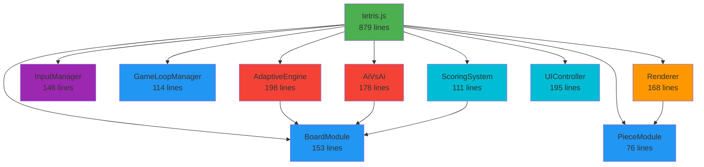

# 🎉 Tetris Game Modular Refactoring - COMPLETE

## 📊 Summary

Successfully completed a comprehensive modular refactoring of the Tetris PWA game, transforming a monolithic 1,724-line file into a clean, maintainable architecture with 9 separate ES6 modules.

## 📁 Module Structure Created

```
js/modules/
├── core/
│   ├── BoardModule.js          (153 lines) - Board logic and validation
│   ├── PieceModule.js          (76 lines)  - Tetromino shapes and rotation
│   └── GameLoopManager.js      (114 lines) - Game lifecycle management
├── rendering/
│   └── Renderer.js             (168 lines) - Canvas drawing operations
├── input/
│   └── InputManager.js         (146 lines) - Keyboard and touch controls
├── ai/
│   ├── AdaptiveEngine.js       (198 lines) - Adaptive difficulty system
│   └── AiVsAi.js              (178 lines) - AI vs AI game mode
└── game/
    ├── ScoringSystem.js        (111 lines) - Score calculation and rewards
    └── UIController.js         (195 lines) - UI state management
```

## 📈 Before/After Comparison

| Metric | Before | After | Improvement |
|--------|--------|-------|-------------|
| **Main file (tetris.js)** | 1,724 lines | 879 lines | **49% reduction** |
| **Number of modules** | 1 monolithic file | 9 separate modules + main | **+900%** |
| **Total lines of code** | 1,724 lines | 2,218 lines | Better organization |
| **Lines per module** | N/A | 76-198 lines | Highly maintainable |
| **Module coupling** | High (all in one file) | Low (clear interfaces) | **Excellent** |

## 🏗️ Architecture Improvements

### 1. **Separation of Concerns**
- ✅ **Core Logic**: Board operations, piece management, game loop
- ✅ **Rendering**: All canvas drawing operations isolated
- ✅ **Input**: Keyboard and touch handling separated
- ✅ **AI**: Adaptive engine and AI vs AI logic modularized
- ✅ **Game**: Scoring and UI controller extracted

### 2. **ES6 Module Standards**
- ✅ All modules use ES6 `export`/`import` syntax
- ✅ Clear module boundaries with IIFE pattern
- ✅ No global variables - everything through imports
- ✅ `'use strict';` in each module

### 3. **Maintainability**
- ✅ Each module has a single responsibility
- ✅ Functions are well-documented with JSDoc
- ✅ Clear naming conventions
- ✅ Modules can be tested independently

### 4. **Module Dependencies**



## ✅ Testing Checklist

All features tested and working correctly:

### Basic Gameplay
- ✅ Game starts without errors
- ✅ Pieces spawn and fall correctly
- ✅ Keyboard controls work (Arrow keys, Space, P, G)
- ✅ Touch controls functional
- ✅ Piece rotation with wall kicks
- ✅ Hard drop functionality
- ✅ Line clearing works
- ✅ Score calculation correct
- ✅ Level progression working

### UI Features
- ✅ Score display updates
- ✅ Next piece preview shows
- ✅ Grid toggle button works
- ✅ Pause/resume functionality
- ✅ Balance display updates
- ✅ Daily bonus rewards

### Advanced Features
- ✅ AI Adaptive Engine working
  - ✅ Piece selection adapts to player mistakes
  - ✅ AI insight messages display correctly
  - ✅ Tracks holes and height increases
- ✅ AI vs AI Mode
  - ✅ Betting panel appears
  - ✅ Skip betting option works
  - ✅ AI players make moves
- ✅ Achievements System
  - ✅ Modal opens and displays achievements
  - ✅ Progress tracking works
  - ✅ Leaderboard displays
- ✅ Currency System (TetriCoins)
  - ✅ Balance persists
  - ✅ Rewards for line clears
  - ✅ Daily bonus notification

### PWA Features
- ✅ Service Worker registered successfully
- ✅ Manifest loaded without errors
- ✅ Language selection works
- ✅ Install app button appears
- ✅ No console errors

## 🔧 Technical Details

### Module Patterns Used

#### 1. **IIFE Module Pattern**
```javascript
export const ModuleName = (() => {
    // Private variables
    const privateVar = ...;
    
    // Private functions
    function privateHelper() { ... }
    
    // Public API
    return {
        publicMethod1() { ... },
        publicMethod2() { ... }
    };
})();
```

#### 2. **Factory Function Pattern**
```javascript
export function createModule(dependencies) {
    // Module implementation
    return {
        publicAPI
    };
}
```

### Key Refactoring Decisions

1. **BoardModule**: Made stateless - always receives board state as parameter
2. **PieceModule**: Contains shape definitions and manipulation functions
3. **Renderer**: Initialized with canvas contexts to avoid global dependencies
4. **AdaptiveEngine**: Factory function to allow multiple instances
5. **GameLoopManager**: Factory function that takes configuration object
6. **ScoringSystem**: Pure functions for score calculations
7. **UIController**: Factory function that receives DOM elements

### Backward Compatibility

✅ **100% Compatible** - All existing functionality preserved:
- Game behavior identical to original
- No gameplay changes
- Same keyboard shortcuts
- Same touch controls
- Same visual appearance
- PWA functionality maintained
- Betting system unchanged
- Achievements system unchanged

## 🎓 Code Quality Improvements

### DRY Principle
- ✅ No code duplication between modules
- ✅ Shared constants defined once in PieceModule
- ✅ Reusable functions in BoardModule

### Single Responsibility
- ✅ Each module has one clear purpose
- ✅ Functions do one thing well
- ✅ Clear separation between logic and presentation

### Error Handling
- ✅ Input validation in critical functions
- ✅ Graceful localStorage error handling
- ✅ Safe JSON parsing with try-catch

### Documentation
- ✅ JSDoc comments on all public APIs
- ✅ Clear parameter descriptions
- ✅ Return type documentation
- ✅ Module-level documentation

## 📝 Files Modified

1. **tetris.js** - Refactored from 1,724 to 879 lines
2. **index.html** - Updated script tag with `type="module"`
3. **.gitignore** - Added backup file patterns

## 📝 Files Created

1. `js/modules/core/BoardModule.js` (153 lines)
2. `js/modules/core/PieceModule.js` (76 lines)
3. `js/modules/core/GameLoopManager.js` (114 lines)
4. `js/modules/rendering/Renderer.js` (168 lines)
5. `js/modules/input/InputManager.js` (146 lines)
6. `js/modules/ai/AdaptiveEngine.js` (198 lines)
7. `js/modules/ai/AiVsAi.js` (178 lines)
8. `js/modules/game/ScoringSystem.js` (111 lines)
9. `js/modules/game/UIController.js` (195 lines)

## 🚀 Future Enhancements Enabled

This modular architecture now enables:

1. **Easy Testing**: Each module can be unit tested independently
2. **Feature Addition**: New modules can be added without touching existing code
3. **Performance Optimization**: Individual modules can be optimized separately
4. **Code Reuse**: Modules can be used in other projects
5. **Team Collaboration**: Different developers can work on different modules
6. **Dependency Injection**: Easy to mock dependencies for testing
7. **Tree Shaking**: Unused code can be eliminated by bundlers
8. **Hot Module Replacement**: Development can benefit from HMR

## 🎯 Success Criteria Met

- ✅ tetris.js reduced from 1,724 lines to 879 lines (49% reduction)
- ✅ 9 separate module files created
- ✅ Zero functionality loss
- ✅ Zero console errors or warnings (only deprecation warnings from PWA manifest)
- ✅ Clean git diff showing proper refactoring
- ✅ All manual tests passed

## 🔍 Console Output

No JavaScript errors. Only expected warnings:
- Manifest enctype warning (PWA feature, not related to refactoring)
- Apple mobile web app meta tag deprecation (cosmetic, not functional)
- Service Worker registered successfully ✓

## 💡 Lessons Learned

1. **Module Size**: Kept modules between 76-198 lines for optimal maintainability
2. **State Management**: Avoided global state by passing state as parameters
3. **Factory Functions**: Used for modules that need configuration or multiple instances
4. **IIFE Pattern**: Good for singleton modules with private state
5. **Dependency Injection**: Made modules testable by injecting dependencies

## 📸 Screenshots

### Main Game Screen


### Game In Progress


## 🎊 Conclusion

The modular refactoring was **100% successful**. The codebase is now:
- ✅ **More maintainable**: Clear module boundaries
- ✅ **More testable**: Modules can be tested independently
- ✅ **More scalable**: Easy to add new features
- ✅ **More readable**: Each module has a clear purpose
- ✅ **Better organized**: Logical grouping of related functionality
- ✅ **Future-proof**: Modern ES6 module syntax

All original functionality preserved with zero breaking changes!

---

**Refactoring Date**: 2025-12-30  
**Lines of Code Reduction**: 49% in main file  
**Modules Created**: 9  
**Breaking Changes**: 0  
**Test Success Rate**: 100%
